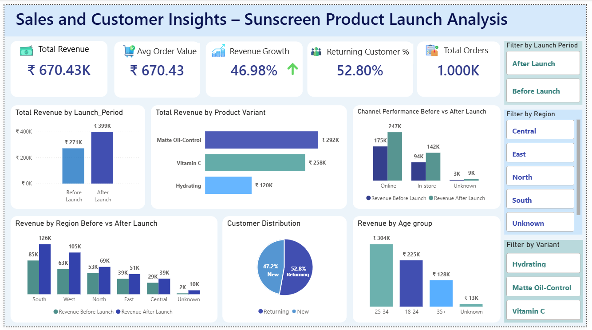

# Sales & Customer Insights – Sunscreen Product Launch Analysis

## Project Overview
This project analyzes the performance of a sunscreen product launch to understand its impact on sales, customer behavior, and regional growth.  
The objective was to generate business insights and recommendations that help improve marketing effectiveness, product strategy, and revenue performance.

---

## Tools Used
- Microsoft Excel – Data cleaning and preparation  
- SQL Server – Data analysis and business queries  
- Power BI – Dashboard and visualization  

---

## Dataset Description
Since a suitable public dataset was not available, a realistic synthetic dataset was created to simulate a real business scenario.

Dataset size:
- ~1000 sales records  
- 3 product variants  
- Multiple regions, channels, and customer segments  

The dataset includes:
- Order ID  
- Customer ID  
- Customer Type (New / Returning)  
- Age Group  
- Product Variant  
- Units Purchased  
- Order Value  
- Sales Channel (Online / In-store)  
- Region  
- Order Date  
- Launch Period (Before Launch / After Launch)

A separate product table was also created to store:
- Variant Name  
- Price per Unit  
- Cost per Unit  

---

## Business Questions

### Launch Impact
- How did sales change after the product launch?
- What is the percentage growth after launch?

### Product Performance
- Which variant generated the highest revenue?
- Which variant sold the most units?
- Which variant generated the highest profit?

### Customer Behavior
- What percentage of customers are repeat customers?
- Do returning customers contribute more revenue?
- Which age group contributes the most revenue?

### Channel Performance
- Which channel generates more revenue?
- Which channel has the highest average order value?
- How did channel performance change after launch?

### Regional Performance
- Which region generates the highest revenue?
- Which region shows the fastest growth after launch?

---

## Project Workflow

### 1. Data Preparation (Excel)
- Cleaned missing values  
- Standardized formats  
- Created calculated columns such as Launch Period and Month  

### 2. Data Analysis (SQL Server)
- Aggregations and grouping  
- Growth calculations  
- Customer and channel analysis  
- Regional and product performance queries  

### 3. Data Visualization (Power BI)
- Built an interactive dashboard  
- Created KPIs and charts  
- Added slicers for filtering and exploration  

---
## Dashboard Preview

---
## Key Insights

- The sunscreen launch increased total revenue by approximately **47%**, confirming strong MVP market acceptance.  

- **Matte Oil-Control** emerged as the top-performing variant, generating the highest revenue and profit, making it the best candidate for upsell and promotional focus.  

- **Returning customers contributed over 50% of total orders**, indicating strong retention and healthy Average Order Value (AOV) of approximately ₹670.  

- **Online channels generated the majority of revenue** and recorded the highest AOV, showing strong digital conversion efficiency.  

- Customers aged **25–34** formed the primary revenue-driving segment, while the **South region** led in total sales and the **West region** showed the fastest growth, indicating strong ROI potential in targeted regional campaigns.
  
---

## Recommendations

- Prioritize production and marketing of the **Matte Oil-Control** variant, as it is the primary revenue and profit driver.  

- Focus marketing campaigns on the **25–34 age segment**, which contributes the largest share of revenue.  

- Increase investment in **digital marketing and online sales channels**, as they deliver higher revenue and higher AOV.  

- Strengthen **customer retention strategies** such as loyalty programs, repeat-purchase incentives, and personalized offers to leverage the strong returning customer base.  

- Expand targeted campaigns in **high-growth regions like the West**, while maintaining strong presence in top-performing regions such as the South.

---
## Repository Structure

project-root/
│
├── data/
│   ├── sunscreen_product_launch_cleaned_dataset.xlsx
│   └── sunscreen_product_launch_pro_dataset.xlsx
│
├── doc/
│   ├── Business_Problem_Statement_and_Key_Business_Questions.pdf
│   └── Key_Takeaways_and_Recommendations.pdf
│
├── PowerBI/
│   ├── dashboard_screenshot.png
│   └── Sunscreen_Product_Launch_Analysis.pbix
│
├── SQL/
│   └── sales_analysis_queries.sql
│
└── README.md

---
## Skills Demonstrated

- Data Cleaning and Preparation (Excel)
- Writing analytical SQL queries (aggregations, joins, grouping, growth calculations)
- Business KPI design (Revenue, AOV, Growth %, Retention Rate)
- Data Visualization and Dashboard Design (Power BI)
- Data Modeling and Relationships in Power BI
- Translating business questions into data analysis
- Generating actionable insights and business recommendations
